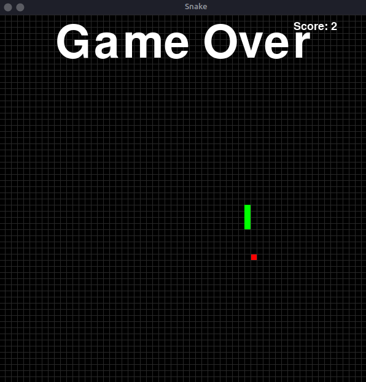

# Pygame-Snake
Jogo de Snake simples e divertido desenvolvido em Python e utilizando o PyGame.
Desenvolvido por Daniel e Rafael Hessel!

## Para rodar o projeto:
<ul>
  <li>Execute <code>pip install pygame</code></li>
  <li>Rode o jogo com <code>python3 snake.py</code></li>
<lu>
